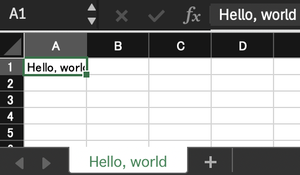

# xlsxgenerator

Create Excel file from JSON/YAML based template

## Features

* Generate styled Excel files from JSON or YAML files.
* Includes a Handlebars template engine for dynamic content.
* Insert CSV or TSV tables from files:
  * Auto-filter with specified filter values.
  * Set cell types for each column.
  * Create hyperlinks based on cell values.
* Insert VCF data from files:
  * Format VCF data for human readability.
* JSON Schema support for template validation.

## Usage

```sh
xlsxgenerator --output example1.xlsx example1.json
```

## Examples

* [Various sheets](./examples/test1.json)
* [With large VCF file](./examples/test2.json)

## Template specification

Please read [JSON Schema](./schema/xlsxgenerator.json) for the strict definition.

### Minimum template

#### JSON version

```json
{
    "sheets": [
        {
            "name": "Hello, world",
            "cells": [
                {
                    "value": "Hello, world"
                }
            ]
        }
    ]
}
```

#### YAML version

```yaml
sheets:
  - name: "Hello, world"
    cells:
      - value: "Hello, world"
```



## Excel Generation Template Specification

This document details the specifications for generating Excel files based on a JSON Schema. The schema defines the structure and format of the Excel templates, which can be customized through various properties and definitions.

### Main Structure

The main object must contain the following properties:

#### Required Properties

- **sheets**: An array of sheet objects. Each sheet is defined using the `sheet` definition.

### Definitions

#### Sheet Object

The `sheet` object includes the following properties:

- **name** (string): The name of the sheet.
- **source** (oneOf):
  - An array of `sheet_source` objects.
  - A string specifying the source.
- **cells** (array): An array of `cell` objects.
- **freeze** (object): Defines the freeze pane settings.
  - **row**: A `row` reference.
  - **column**: A `column` reference.
- **column-widths** (array): An array of numbers defining the widths of columns.
- **row-heights** (array): An array of numbers defining the heights of rows.
- **images** (array): An array of objects defining images to be inserted into the sheet.
  - **file** (string): The file path of the image.
  - **row**: A `row` reference.
  - **column**: A `column` reference.
  - **width-scale** (number): The width scale of the image.
  - **height-scale** (number): The height scale of the image.

#### Cell Object

The `cell` object contains the following properties:

- **row**: A `row` reference.
- **column**: A `column` reference.
- **row-relative** (integer): Relative row position.
- **column-relative** (integer): Relative column position.
- **format**: A `format` reference.
- **value**: A `cell_value` reference.
- **type**: A `cell_type` reference.
- **comment** (string): A comment for the cell.
- **url** (string): A URL linked to the cell.
- **merge-row** (integer): The number of rows to merge.
- **merge-column** (integer): The number of columns to merge.

#### Sheet Source Object

The `sheet_source` object includes the following properties:

- **start-row**: A `row` reference.
- **start-column**: A `column` reference.
- **vcf-config**: A `vcf_config` reference.
- **file** (string): The file path of the source file.
- **data** (string): The data as a string.
- **format** (enum): The format of the source file. Possible values are `CSV`, `TSV`, `VCF`, `Auto`.
- **columns** (array): An array of objects defining columns.
  - **format**: A `format` reference.
  - **type**: A `cell_type` reference.
  - **header-type**: A `cell_type` reference for the header.
  - **header-value**: A `cell_value` reference for the header.
  - **header-comment** (string): A comment for the header.
  - **link-prefix** (string): A prefix for links.
- **autofilter** (boolean): Whether to apply autofilter.
- **filter-list** (object): An object defining auto filter conditions.
  - **items** (array): An array of strings defining filter items.
  - **column-header** (string): The header of the column to filter.
- **table** (boolean): Whether to format the range as a table.
- **table-style-type** (enum): The style type for the table. Possible values are `default`, `light`, `medium`, `dark`.
- **table-style-type-num** (integer): The style number for the table type, ranging from 1 to 28.
- **has-header** (boolean): Whether the first line is a header.
- **comment-line-prefix** (string): The prefix for comment lines in the source file.

#### VCF Configuration Object

The `vcf_config` object includes the following properties:

- **split-multi-allelic** (boolean): Specifies whether to split multi-allelic variants into separate records.
- **decode-genotype** (boolean): Specifies whether to decode genotype information.
- **info** (array): An array of strings specifying which INFO fields to include.
- **format** (array): An array of strings specifying which FORMAT fields to include.
- **priority-info** (array): An array of strings specifying the priority order of INFO fields.
- **priority-format** (array): An array of strings specifying the priority order of FORMAT fields.

#### Additional Definitions

- **column**: An integer with a minimum value of 0.
- **row**: An integer with a minimum value of 0.
- **border_type**: An enumeration of possible border types.  Possible values are `none`, `thin`, `medium`, `dashed`, `dotted`, `thick`, `double`, `hair`, `medium-dashed`, `dash-dot`, `medium-dash-dot`, `dash-dot-dot`, `medium-dash-dot-dot`, `slant-dash-dot`.
- **border_format**: An object defining the border format.
  - **type**: A `border_type` reference.
  - **color** (string): The color of the border.
- **format**: An object defining the cell format.
  - **font-name** (string): The name of the font.
  - **font-size** (number): The size of the font.
  - **font-color** (string): The color of the font.
  - **background-color** (string): The background color of the cell.
  - **num-format** (string): The number format of the cell.
  - **border** (oneOf):
    - A `border_type` reference.
    - A `border_format` reference.
    - An array of `border_format` objects, with a minimum of 1 and a maximum of 4 items.
- **cell_value**: A value for the cell, which can be a string, null, boolean, or number.
- **cell_type**: An enumeration of possible cell types. Possible values are `string`, `number`, `percent`, `integer`, `datetime`, `formula`, `boolean`, `url`, `null`.

This specification allows for the creation of highly customizable Excel templates, ensuring that each sheet, cell, and format can be tailored to specific requirements.